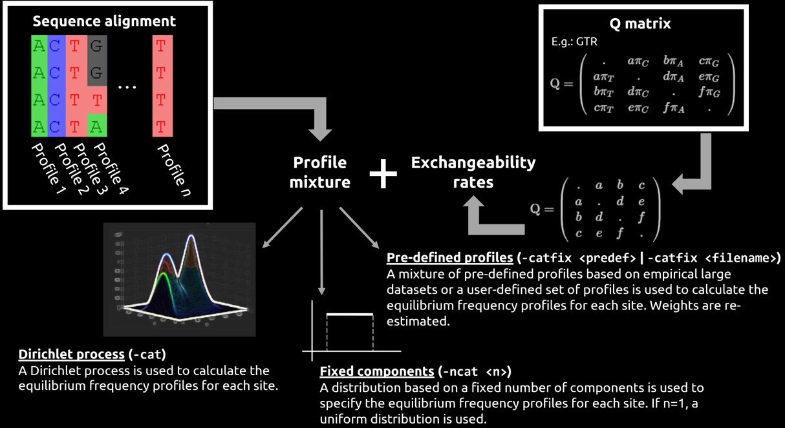

# Phylogeny inference with `PhyloBayes`

## Brief introduction

We have simulated a 12-taxon alignment consisting of 50 AA residues ([`prot_aln.phy`](00_inp_data/prot_aln.phy)) under a specific model (we shall reveal this later! :smile: ).

At the end of the practical session, we shall have a general discussion based on the results we will have obtained guided by the following questions:

* What do you think about our inference results? Are the inferred parameter values close to those we used to simulate our dataset?
* If you were to carry out these analyses again, would you change anything? If so, which steps would you change and why? Would you run a different program?

But now, without further ado... Let's start our practical on Bayesian phylogeny inference with `PhyloBayes`!

## Input data

The input sequence files read by `PhyloBayes` must have a PHYLIP format:

```text

<num_taxa> <num_characters>

sp_1 
sp_2

.
.
.

sp_n
```

> [!IMPORTANT]
>
>* Taxa labels (or tag identifiers) may have more than 10 characters (i.e., "relaxed" PHYLIP format), but it is recommended to keep it short.
>* At least one space between the tag identifier and the first character of the sequence string is required. In other words, if you put at least one space after the tag identifier, `PhyloBayes` will expect you to start the sequence after such a space!
>* The following characters will all be considered equivalent to missing data: `-`, `?`, `$`, `.`, `*`, `X`, `x`, as well as the degenerate bases of nucleic acid sequences (`B`, `D`, `H`, `K`, `M`, `N`, `R`, `S`, `V`, `W`, `Y`), and the `B` and `Z` characters for protein sequences.

Please note that, even though we have used a 12-taxon tree topology to simulate our alignment, we will not be using an initial tree for the tree search nor constrain a specific tree topology under which sampling would take place (i.e., we will not use options `-t` or `-T`, respectively). We will try to see whether we can recover the same phylogeny when running `PhyloBayes`. Nevertheless, if you were to use the aforementioned options when analysing your dataset, please bear in mind that the input tree file should be in **NEWICK format**. In addition, **the tag identifiers for the taxa present in your phylogeny must match those you have in your alignment (they are case sensitive!)**.

> [!IMPORTANT]
> If there are taxa that you included in your input tree file but you missed in your input sequence file, such taxa will be pruned from your tree topology. Nevertheless, if there are taxa present in the input sequence file but you did not include them in your input tree file, `PhyloBayes` will exit with an error message.

## The `CAT` model, exchangeability rates, and profile mixture

The **CAT (categories) model** was proposed by Lartillot and Philippe ([2004](http://www.atgc-montpellier.fr/download/papers/cat_2004.pdf)) with the aim to relax the assumption that the same substitution process is responsible for how the sites of a protein evolve. The main key points of this model are the following:

* The tendency of each nucleotide or residue to be in a specific site position in a molecular alignment depends on various biological processes (e.g., selective constraints), and thus it is not equal (an assumption made by site-homogeneous models). **Linking nucleotide or residue equilibrium frequencies** to the **substitution process** has shown to **reduce systematic errors** in phylogeny inference such as **long-branch attraction** problems, and it is **less prone to underestimate branch lengths**.

> [!NOTE]
> The `CAT` models implemented in `PhyloBayes` can account for among-site compositional heterogeneity when using both nucleotide and protein alignments.

* Each site in the alignment is assigned a **frequency vector profile** over the 20 AA residues or the 4 nucleotide bases (i.e., not all residues/bases are equally probable at each site). By **combining such vector profiles** (profile mixture) with a **globally defined set of exchange rates**, we can derive **site-specific substitution processes**. It is noteworthy that the global exchange rates can be fixed to **uniform** values (e.g., `-poi`; mixture of Poisson F81 process) or **empirical estimates** (e.g., `-lg`, `-wag`, `-jtt`, `-mtrev`, `-mtzoa`, `-mtart`) -- useful when analysing very large phylogenomic datasets to reduce computational time. Alternatively, they can also be **inferred from the data** (i.e., `-gtr`). Users can also implement their own custom set of exchange rates or set of profiles should they wish to do so (i.e., `-rr <filename>`; exchangeabilities are fixed to the values given in `<filename>`)!

> [!IMPORTANT]
> Any set of **exchange rates** can be combined with any of the three types of **profile mixture** implemented in `PhyloBayes`, but the same set of exchange rates will be used by all components of the mixture:
>
>* A Dirichlet process is used to infer the frequency profiles across sites: `-cat`. Non-parametric **Dirichlet processes** (sometimes considered as a "distribution of distributions" or "infinite mixture models") are used to model the aforementioned **site-specific equilibrium frequency profiles**. Note that Dirichlet processes assume that there are an infinite number of clusters/categories to which each site can be assigned, but we do not know _a priori_ which category each site goes to. In phylogenetic inference, each site of the input sequence alignment will be given a **frequency vector profile** over the 20 AA residues (if protein data) or over the 4 nucleotide bases (if nucleotide data). Such a vector will then be used to calculate the probability of each residue/base being at each site, hence why this process can account for among-site compositional heterogeneity.
>* A mixture of $n$ components/categories is **fixed**, but weights and profiles are random variables: `-ncat <n>`. If `-ncat 1`, a uniform density will be enabled to model the equilibrium frequency profiles across sites. In other words, there will be one unique matrix of profiles (one single category) for all the sites of the sequence alignment.
>* A mixture of **pre-defined profiles** are used (weights are re-estimated). Empirical models (e.g., CXX) used have a fixed number of components estimated on a large database of MSAs: `-catfix <predef>`.
>* A mixture of **user-pre-defined profiles** are used. Users may have established their own empirical model after estimating its fixed components on their dataset/s: `-catfix <filename>`.
>
> Nevertheless, the same set of exchange rates will be used by all components of the mixture!

E.g.: If the GTR model, `-gtr`, was chosen to infer the global exchange rates from nucleotide data...

> **Rate matrix (GTR)**

$$\mathrm{Q=}\left(\begin{array}{cccc}
. & a\pi_{C} & b\pi_{A} & c\pi_{G}\\
a\pi_{T} & . & d\pi_{A} & e\pi_{G}\\
b\pi_{T} & d\pi_{C} & . & f\pi_{G}\\
c\pi_{T} & e\pi_{C} & f\pi_{A} & .
\end{array}\right)$$

**Exchange rates**:

$$\mathrm{Q=}\left(\begin{array}{cccc}
. & a & b & c\\
a & . & d & e\\
b & d & . & f\\
c & e & f & .
\end{array}\right)$$

>> The exchange rates (free parameters) will be the same for all components of the profile mixture selected by the user. The example above shows an example under the GTR model, but other matrices are available: `-poi`, `-lg`, `-wag`, `-jtt`, `-mtrev`, `-mtzoa`, `-mtart`, `-rr <filename>`.

**Equilibrium frequencies**:
$\left[\pi_{A},\pi_{T},\pi_{C},\pi_{G}\right]$

>> The equilibrium frequencies can vary depending on the profile mixture: `-cat`, `-ncat <n>`, `-catfix <predef>`, `-catfix <filename>`.

If we try to put all the information above in one (very simplified!) image...

<p align="center">
 
</p>

* Some of the models you could try to run in `PhyloBayes` are shown below:

<table>

<!-- HEADER -->
<tr>
<th>Profile mixture<br>(Equilibrium frequency profiles across sites)</th>
<th>Exchange rates<br>(Uniform/Estimated/Empirical)</th>
<th><code>PhyloBayes</code> option </th>
</tr>
<!-- FIRST ROW -->
<tr>
<td rowspan="4">Among-site compositional heterogeneity (CAT)</td><td>Poisson (F81, equal amino-acid exchange rates and frequencies)</td><td><code>-cat -poisson</code></td>
</tr>
<tr>
<td>GTR (general time reversible model with unequal rates and unequal base frequencies)</td><td><code>-cat -gtr</code></td>
</tr>
<tr>
<td>LG, WAG, JTT, MTREV, MTZOA, MTART</td><td><code>-cat -lg</code>, <code>-cat -wag</code>, <code>-cat -jtt</code>, <code>-cat -mtzoa</code>, <code>-cat -mtart</code></td>
</tr>
<tr>
<td>Own exchangeability rates</td><td><code>-cat -rr [user_filename]</code></td>
</tr>
<!-- SECOND ROW -->
<tr>
<td rowspan="4">Among-site compositional homogeneity</td><td>Poisson (F81, equal amino-acid exchange rates and frequencies)</td><td><code>-ncat -poisson</code></td>
</tr>
<tr>
<td>GTR (general time reversible model with unequal rates and unequal base frequencies)</td><td><code>-ncat 1 -gtr</code> OR <code>-gtr</code></td>
</tr>
<tr>
<td>LG, WAG, JTT, MTREV, MTZOA, MTART</td><td><code>-ncat 1 -lg</code>, <code>-ncat 1 -wag</code>, <code>-ncat 1 -jtt</code>, <code>-ncat 1 -mtzoa</code>, <code>-ncat 1 -mtart</code></td>
</tr>
<tr>
<td>Own exchangeability rates</td><td><code>-ncat 1 -rr [user_filename]</code></td>
</tr>
<!-- THIRD ROW -->
<tr>
<td rowspan="4">Empirical mixture models (e.g., "CXX" [Quang et al., 2008], "WLSR5" [Wang et al., 2008], or user-defined empirical profiles) </td><td>Poisson (F81, equal amino-acid exchange rates and frequencies)</td><td><code>-catfix c10</code></td>
</tr>
<tr>
<td>GTR (general time reversible model with unequal rates and unequal base frequencies)</td><td><code>-catfix c60 -gtr</code></td>
</tr>
<tr>
<td>LG, WAG, JTT, MTREV, MTZOA, MTART</td><td><code>-catfix C10 -lg</code>, <code>-catfix C10 -wag</code>, <code>-catfix WLSR5 -jtt</code>, <code>-catfix C10 -mtzoa</code>, <code>-catfix C10 -mtart</code></td>
</tr>
<tr>
<td>Own exchangeability rates</td><td><code>-catfix [user_filename_prof] -rr [user_filename_er]</code></td>
</tr>

</table>

## Running `PhyloBayes`

Once we have our simulated alignments ready, we can run `PhyloBayes`! We will carry out the following Bayesian phylogeny inferences to see whether we can recover the true phylogeny:

* `CAT+GTR`: **among-site compositional heterogeneity** is assumed. The exchangeability rates will be based on the **GTR substitution matrix** (`-gtr`) and a **Dirichlet process will be used to infer the frequency profiles across sites** (CAT model. `-cat`).
* `GTR`: **among-site compositional homogeneity** is assumed. The exchangeability rates will be based on the **GTR substitution matrix** (`-gtr`) and a **uniform density will be modelling frequency profiles across sites** (i.e., `-ncat 1`, one single matrix of profiles for all sites of the alignment).
* `CAT+LG`: **among-site compositional heterogeneity** is assumed. The exchangeability rates will be based on the **LG substitution matrix** (`-lg`) and a **Dirichlet process will be used to infer the frequency profiles across sites** (CAT model. `-cat`).
* `LG`: **among-site compositional homogeneity** is assumed. The exchangeability rates will be based on the **LG substitution matrix** (`-lg`) and a **uniform density will be modelling frequency profiles across sites** (i.e., `-ncat 1`, one single matrix of profiles for all sites of the alignment).

> [!IMPORTANT]
> Other commands that we will be using that we have not mentioned before:
>
> * `-s`: in `PhyloBayes` v4.9a, the "save all" mode is activated. In other words, both the tree topologies and all parameters sampled during the MCMC are saved. Nevertheless, when using the MPI version of `PhyloBayes` v1.9, this option does nothing.
> * `-d`: option used to specify the path to the input sequence file.
> * `-x`: the frequency with which the samples are saved can be specified, e.g., `-x 500` would save every 500 samples "forever" or until the chains are stopped. If a second number is included, however, one can also specify the number of samples that are to be collected so that the chains can stop. E.g., `-x 500 20000` would make `PhyloBayes` collect samples every 500 iterations until a total of 20,000 samples are saved, after which the chain would stop.

While yesterday you learnt how to use ML-based approaches to compare different evolutionary models, today you will learn how to use **cross-validation** to do so! Firstly, we will create our working environment so that we can have as many directories (folders) as models we are going to be testing:

```sh
# Run from `01_PhyloBayes`
for i in `seq 1 4`
do
mkdir -p {pb_catgtr,pb_gtr,pb_catlg,pb_lg}/$i
done
```

Then, we will access one of the directories we have just created and run one chain under one model. For instance, to run the first chain under CAT+GTR, we would do the following:

```sh
# Run from `01_PhyloBayes`
# We will run one chain under the CAT+GTR model for protein data
cd pb_catgtr/1
pb -s -d ../../../00_inp_data/prot_aln.phy -cat -gtr -x 10 500 pb_catgtr_run1 &
# If you want to keep that PID number in a file, you can run
# the following code
pid=$!
echo Start job for chain 1 under and PI process $pid > log_pb_catgtr_chain1_PIDval.txt
```

As you can see, by typing the `&` at the end of the command that runs `PhyloBayes`, you can now keep using the terminal while the Bayesian program is running on the background! These analyses are not as quick as those you ran yesterday under a ML-based approach -- they can take from hours to months (even much longer sometimes) to reach convergence! Consequently, **we will be using the output files that we have already generated to continue the practical**.

If you were to run these analyses on your own (it will take many hours), however, you could use the code snippet below -- **please do not run the code below on the server because, if we all do this, we may collapse it!**

```sh
# Run from `01_PhyloBayes`
# First, create working directories for the chains
# we will run
for i in `seq 1 4`
do
mkdir -p {pb_catgtr,pb_gtr,pb_catlg,pb_lg}/$i
done
# Run PhyloBayes under each model,
# 4 chains per model
## A. CAT-GTR (heterogeneous)
cd pb_catgtr
for i in `seq 1 4`
do
cd $i
pb -s -d ../../../00_inp_data/prot_aln.phy -cat -gtr -x 10 500 pb_catgtr_run$i &
pid=$!
if [[ $i -eq 1 ]]
then
echo Start job for chain $i under CAT+GTR and PI process $pid > log_pb_catgtr_chain$i"_PIDval.txt"
else
echo Start job for chain $i under CAT+GTR and PI process $pid >> log_pb_catgtr_chain$i"_PIDval.txt"
fi
cd ../
done
## B. GTR (homogeneous)
cd ../pb_gtr
for i in `seq 1 4`
do
cd $i
pb -s -d ../../../00_inp_data/prot_aln.phy -ncat 1 -gtr -x 10 500 pb_gtr_run$i &
pid=$!
if [[ $i -eq 1 ]]
then
echo Start job for chain $i under GTR and PI process $pid > log_pb_gtr_chain$i"_PIDval.txt"
else
echo Start job for chain $i under GTR and PI process $pid >> log_pb_gtr_chain$i"_PIDval.txt"
fi
cd ../
done
## C. CAT+LG (heterogeneous)
cd ../pb_catlg
for i in `seq 1 4`
do
cd $i
pb -s -d ../../../00_inp_data/prot_aln.phy -cat -lg -x 10 500 pb_catlg_run$i &
pid=$!
if [[ $i -eq 1 ]]
then
echo Start job for chain $i under CAT+LG and PI process $pid > log_pb_catlg_chain$i"_PIDval.txt"
else
echo Start job for chain $i under CAT+LG and PI process $pid >> log_pb_catlg_chain$i"_PIDval.txt"
fi
cd ../
done
## D. LG (homogeneous)
cd ../pb_lg
for i in `seq 1 4`
do
cd $i
pb -s -d ../../../00_inp_data/prot_aln.phy -ncat 1 -lg -x 10 500 pb_lg_run$i &
pid=$!
if [[ $i -eq 1 ]]
then
echo Start job for chain $i under LG and PI process $pid > log_pb_lg_chain$i"_PIDval.txt"
else
echo Start job for chain $i under LG and PI process $pid >> log_pb_lg_chain$i"_PIDval.txt"
fi
cd ../
done
```

----

<details>
<summary><b>If you were to run the same analyses above but using the MPI version of `PhyloBayes` v1.9...</b></summary>
<br>

```sh
# Run from `01_PhyloBayes`
# Run PhyloBayes under each model,
# 4 chains per model using two threads
# (i.e., `-np 2`)
# You may want to adapt according to
# your environment
## A. CAT+GTR (heterogeneous)
cd pb_catgtr
for i in `seq 1 4`
do
cd $i
mpirun -np 2 pb_mpi -d ../../../00_inp_data/prot_aln.phy -cat -gtr -x 10 500 mpi_pb_catgtr_run$i &
pid=$!
if [[ $i -eq 1 ]]
then
echo Start job for chain $i under CAT+GTR and PI process $pid > log_pb_catgtr_chain$i"_PIDval.txt"
else
echo Start job for chain $i under CAT+GTR and PI process $pid >> log_pb_catgtr_chain$i"_PIDval.txt"
fi
cd ../
done
## B. GTR (homogeneous)
cd ../pb_gtr
for i in `seq 1 4`
do
cd $i
mpirun -np 2 pb_mpi -d ../../../00_inp_data/prot_aln.phy -ncat 1 -gtr -x 10 500 mpi_pb_gtr_run$i &
pid=$!
if [[ $i -eq 1 ]]
then
echo Start job for chain $i under GTR and PI process $pid > log_pb_gtr_chain$i"_PIDval.txt"
else
echo Start job for chain $i under GTR and PI process $pid >> log_pb_gtr_chain$i"_PIDval.txt"
fi
cd ../
done
## D. CAT+LG (heterogeneous)
cd ../pb_catlg
for i in `seq 1 4`
do
cd $i
mpirun -np 2 pb_mpi -d ../../../00_inp_data/prot_aln.phy -cat -lg -x 10 500 mpi_pb_cat_lg_run$i &
pid=$!
if [[ $i -eq 1 ]]
then
echo Start job for chain $i under CAT+LG and PI process $pid > log_pb_catlg_chain$i"_PIDval.txt"
else
echo Start job for chain $i under CAT+LG and PI process $pid >> log_pb_catlg_chain$i"_PIDval.txt"
fi
cd ../
done
## D. LG (homogeneous)
cd ../pb_lg
for i in `seq 1 4`
do
cd $i
mpirun -np 2 pb_mpi -d ../../../00_inp_data/prot_aln.phy -ncat 1 -lg -x 10 500 mpi_pb_lg_run$i &
pid=$!
if [[ $i -eq 1 ]]
then
echo Start job for chain $i under LG and PI process $pid > log_pb_lg_chain$i"_PIDval.txt"
else
echo Start job for chain $i under LG and PI process $pid >> log_pb_lg_chain$i"_PIDval.txt"
fi
cd ../
done
```

</details>

----

## Summarising output trace and tree files

Let's now work with the output files, which have been compressed and saved in directory [`pb_out`](pb_out):

```sh
# Run from `01_PhyloBayes`
# Just in case you have run something
# and saved it inside `01_PhyloBayes`,
# please run the following command
for i in pb_*
do
tar -zcvf $i".tar.gz" $i
rm -r $i
done
mkdir 00_pb_tests
mv *gz 00_pb_tests
# Create directory for the data
# we will be summarising
mkdir 01_pb_results
# Now, move to directory `pb_out`
cd ../pb_out
# Extract the output files we will be
# summarising during this session
for i in *gz
do
printf "\n[[ Extracting file "$i" ]]\n"
tar -xvf $i
name=$( echo $i | sed 's/\.tar..*//' )
mv $name ../01_PhyloBayes/01_pb_results
done
```

The most important output files that are generated by `PhyloBayes` are the following:

* `*treelist`: all sampled tree topologies with branch lengths are saved in this tree.
* `*trace`: this file contains all the summary statistics such as the log likelihood, the total tree length, the number of occupied components of the mixture, the mean site entropy, etc. The number of lines of the trace file shows the current MCMC sample size (e.g., `wc -l *trace`).

> [!IMPORTANT]
> At least two chains must be run to check whether the samples collected independently have converged toward the same target distribution. In this example, we have run 4 independent chains for each analysis.

While the chains are running, you can check chain convergence and mixing by using the in-built `PhyloBayes` programs `bpcomp` and `tracecomp`. We can therefore assess whether the posterior consensus tree is reproducible across the two independent runs we launched under each model as well as the trace plots of the summary statistics capture the sub-components of the model seem to have reached a stationary distribution and are reproducible across runs.

To check for convergence of continuous parameters of the model, you can run the `tracecomp` program, which will parse the output files `*trace`:

```sh
# Run from `01_PhyloBayes/01_pb_results/pb_catgtr`
tracecomp -x 1 1/pb_catgtr_run1.trace 2/pb_catgtr_run2.trace 3/pb_catgtr_run3.trace 4/pb_catgtr_run4.trace
# You can also use regular expressions!
tracecomp -x 1 */*trace
# Now, you can put this in a loop to
# get the stats for all the runs!
cd ../
# Now you are in `01_PhyloBayes`
# Run stats for all trace files inside
# all `pb_*` directories
for i in pb_*
do
cd $i
printf "\n[[ Summarising traces for dataset "$i" ... ... ]]\n"
tracecomp -x 1 */*trace
mv tracecomp.contdiff tracecomp_$i.contdiff
cd ../
done
```

This command will result in a screen output similar to the following (numerical values will vary depending on how many iterations have been completed when you run the command!) for each of the models:

```text
initialising random
seed was : 697363

setting upper limit to : 544
name                effsize     rel_diff

loglik              543         0.0778594
length              505         0.104418
alpha               331         0.196835
nmode               543         0
stat                528         0.125112
statalpha           543         0
kappa               543         0
allocent            543         0
```

> [!NOTE]
> Only the table will be saved in a file called `tracecomp.contdiff` in the same directory where the command was run (i.e., inside each `pb_*` directory!). We have renamed each file under each directory with the name of the model under which inference took place to easily keep track of each analysis.

The **effective sample size**, `effzise` column, can be used to estimate the **effective number of independent points that have been sampled by each chain**. The **discrepancy**, `rel_diff` column, is a statistic that shows the **mean deviation among the chains ran** (i.e., four chains in this case) for each of the parameters to be estimated (i.e., each column in the trace file) normalised by the within-chain standard deviation of the parameter to be estimated and averaged over all pairs of runs.

The following statistics would be **ideal**: an effective size of 1,000 and a discrepancy smaller than 0.1. Nevertheless, these values are somewhat _utopic_ within the field of phylogenomics due to the complex parameter space to be explored. Generally, as a rule of thumb:

* **Discrepancies** lower than **0.3** or slightly above and minimum **effective sizes** larger than **50** tend to yield **acceptable runs**.
* **Discrepancies** lower than **0.1** or slightly above and minimum **effective size** larger than **300** tend to yield **good runs**.

> [!NOTE]
> If we were happy with our summary statistics and decided to stop the chains, we could do so by typing `kill` and the name of the PID you were prompted. If you have stopped a run but wanted to resume it, you can type `pb <name_run>`.

Next, we can also run `bpcomp` to check the differences between bipartition frequencies when exploring the sampled trees:

```sh
# Run from `pb_catgtr`
bpcomp -x 10 1/pb_catgtr_run1.treelist 2/pb_catgtr_run2.treelist 3/pb_catgtr_run3.treelist  4/pb_catgtr_run4.treelist
# You can also use regular expressions!
bpcomp -x 10 */*treelist
# Now, you can put this in a loop to
# get the stats for all the runs!
cd ../
# Now you are in `01_PhyloBayes`
# Run stats for all trace files inside
# all `pb_*` directories
for i in pb_*
do
cd $i
printf "\n[[ Summarising trees for dataset "$i" ... ... ]]\n"
bpcomp -x 10 */*treelist
mv bpcomp.bpdiff bpcomp_$i.bpdiff
mv bpcomp.bplist bpcomp_$i.bplist
mv bpcomp.con.tre bpcomp_$i.con.tre
cd ../
done
```

You will see that, apart from getting the consensus tree (i.e., output file with extension `con.tre`), you will get two additional output files:

* `*.bplist`: output file that one should read to check which bipartitions present more discrepancies between chains -- you should see as many columns as chains were run! This bipartition list is merged to generate the consensus tree.
* `*.bpdiff`: `meandiff` and `maxdiff` values referring to the maximum and minimum difference values in bipartition frequencies among the chains run. If we obtained `maxdiff = 1`, the program would be hinting mixing issues: at least one clade appears with probability equal to 1 in one chain and 0 in another. File `*.bplist` can be used to further investigate which bipartitions are problematic and, if the clade of interest is not affected and discrepancies between chains are low, we could potentially continue our analysis.

Now, time to explore our runs with `Tracer`!

> [!NOTE]
> There seems to be a couple of `#` in the header line when running v4.9 (not output when running the MPI version), and so `Tracer` may not properly read this file. To fix this issue, you can do the following:
>
> ```sh
> # Run from `01_PhyloBayes/01_pb_results`
> for i in pb_*
> do
> printf "Parsing files in dir "$i" ...\n"
> cd $i
> cp */*trace .
> sed -i 's/\#//g' *trace
> for j in *trace
> do
> name=$( echo $j | sed 's/\.trace//' )
> cut -f1,4- $j > $name"_out.trace"
> rm $j
> done
> cd ../
> done
> ```

> [!WARNING]
> If you have very large trace files, you may not want to create a copy. Instead, you could directly remove the `#` -- otherwise, you may end up running out of diskspace!

What does each column mean in the `*trace` file?

* `loglik`: log-likelihood score.
* `length`: tree length.
* `alpha`: shape parameter of the gamma distribution used to model rate heterogeneity across sites.
* `nmode`: number of occupied components of the mixture.
* `stat`: stationary entropy (diversity of stationary probabilities across sites).
* `statalpha`: Dirichlet process concentration parameter (controls the granularity of site-specific substitution profiles).
* `rrent`: entropy of the relative exchange rates (variability in substitution rate across sites).
* `meanrr`: posterior means of the relative exchange rates across sites (reflects the rate of substitution at each site compared to a baseline or average rate across all sites).
* `kappa`: transition/transversion rate, if applicable.
* `allocent`: allocation of entropy.

## Model selection: cross-validation

We are going to compare the various models we have ran for each dataset by conducting a cross-validation (CV) approach.

> [!NOTE]
> Please note that, for very large datasets, this approach may be too computationally demanding, and so other methods such as the widely applicable information criterion (wAIC) could be used instead.

To run a CV analysis with our dataset, we will first need to generate pairs of learning and test subsets. Ideally, we would generate 10 replicates of such pairs but, to keep computational costs low, we will only generate 1 replicate:

```sh
# Run from `01_PhyloBayes`
# Generate 1 learning/test subset
mkdir 02_modsel_CV
cd 02_modsel_CV
mkdir 00_learntest
cd 00_learntest
cvrep -nrep 1 -nfold 10 -d ../../../00_inp_data/prot_aln.phy cvb
# Go back to `02_modsel_CV
cd ../
```

> [!IMPORTANT]
> Option `-nfold` specifies that, for each replicate, we assign 90% of our simulated protein dataset will be assigned to the "learning" dataset and 10% to the "test" dataset that will be used during CV. The learning/test replicates will be saved in a file which name starts with prefix `cvb`. E.g. as we have 1 replicate, we would see the following files being generated: `cv0_learn.ali` + `cv0_test.ali`. Nevertheless, if more replicates were to be generated, you would see pairs of subsets such as `cv1_learn.ali` + `cv1_test.ali`,  `cv2_learn.ali` + `cv2_test.ali`, etc.

Once we have our pair learning/test subset, we will run `PhyloBayes` on the learning subset under different models and a fixed tree topology to save computational time:

```sh
# Run from `02_modsel_CV`
mkdir 01_learn_runpb
cd 01_learn_runpb
# Copy the consensus tree topology inferred from
# one of the previous runs. E.g.: CAT+GTR
cp ../../01_pb_results/pb_catgtr/bpcomp_pb_catgtr.con.tre .
# We will sample every iteration to avoid too much computation
mkdir cat_gtr
## CAT+GT
cd cat_gtr
pb -d ../../00_learntest/cvb0_learn.ali -T ../bpcomp_pb_catgtr.con.tre -cat -gtr -x 1 500 CATGTRcvb0_learn.ali &
pid=$!
echo Start job for CAT+GTR and PI process $pid > log_cv_cat_gtr_PIDval.txt
cd ../
## GTR
mkdir gtr
cd gtr
pb -d ../../00_learntest/cvb0_learn.ali -T ../bpcomp_pb_catgtr.con.tre -ncat 1 -gtr -x 1 500 GTRcvb0_learn.ali &
pid=$!
echo Start job for GTR and PI process $pid > log_cv_gtr_PIDval.txt
cd ../
## CAT+LG
mkdir cat_lg
cd cat_lg
pb -d ../../00_learntest/cvb0_learn.ali -T ../bpcomp_pb_catgtr.con.tre -cat -lg -x 1 500 CATLGcvb0_learn.ali &
pid=$!
echo Start job for CAT+LG and PI process $pid > log_cv_cat_lg_PIDval.txt
cd ../
## LG
mkdir lg
cd lg
pb -d ../../00_learntest/cvb0_learn.ali -T ../bpcomp_pb_catgtr.con.tre -ncat 1 -lg -x 1 500 LGcvb0_learn.ali &
pid=$!
echo Start job for LG and PI process $pid > log_cv_lg_PIDval.txt
cd ../
```

Now, we can calculate the likelihood values for the test subset for each model:

```sh
# Run from `02_modsel_CV/01_learn_runpb`
## Options when running `readcv`:
##  * `-rep 0` means that we are summarising samples for the
##     first replicate (i.e. "0")
##  * `-x 50 1` means that we will be discarding the first
##     50 points as burn-in, then take every sample thereafter
#
# We will need to copy the test subset in each directory
## CAT+GTR
cd cat_gtr
cp ../../00_learntest/cvb0_test.ali .
readcv -rep 0 -x 50 1 CATGTR cvb
## GTR
cd ../gtr
cp ../../00_learntest/cvb0_test.ali .
readcv -rep 0 -x 50 1 GTR cvb
## CAT+LG
cd ../cat_lg
cp ../../00_learntest/cvb0_test.ali .
readcv -rep 0 -x 50 1 CATLG cvb
## LG
cd ../lg
cp ../../00_learntest/cvb0_test.ali .
readcv -rep 0 -x 50 1 LG cvb
cd ../
# Lastly, we collect all likelihood values
# and do pairwise comparisons using one
# of the models (CAT+GTR) as the reference
cp */*\.cv .
sumcv -nrep 1 CATGTR GTR CATLG LG cvb
```

The results are summarised as follows as screen output:

```text
models compared         mean score +- stdev     #times model is best

GTR versus CATGTR : -0.2863 +/- 0       0
CATLG versus CATGTR : 1.1842 +/- 0      0
LG versus CATGTR : 1.5849 +/- 0 1

positive scores: better than reference model (CATGTR)
```

As shown above, we can see all the pairwise comparisons having the `CAT+GTR` model as the reference model. **what evolutionary model do you think we simulated the data with**?

----

<details>
<summary><b>Reveal only after you have had a guess! No spoilers!</b></summary>
<br>

We simulated a 12-taxon alignment consisting of 50 AA residues ([`prot_aln.phy`](00_inp_data/prot_aln.phy)) using the LG substitution matrix under the empirical+F model implemented in the `PAML` program `evolver` specifying the following settings:

* Alpha value for the gamma distribution used to account for rate heterogeneity: 0.76634
* Number of categories to discretise the gamma distribution: 4
* Tree length: 0.408202
* AA substitution model: empirical+F model (`3`) using the LG exchangeability rates
* AA frequencies:

  ```text
  0.08795 0.07309 0.03045 0.04980 0.00873 0.03193 0.06778 0.07890 0.01988 0.07401
  A R N D C Q E G H I
  0.09850 0.05890 0.02529 0.03450 0.03928 0.04833 0.05270 0.00543 0.02701 0.08754
  L K M F P S T W Y V
  ```

The abovementioned settings are ML estimates that were obtained when analysing a bacterial dataset with `CODEML`.

</details>

----

Based on what we have done today and what we have been discussing so far during the course, let's go back to the questions we started with and address them all together!

* What do you think about our inference results? Are the inferred parameter values close to those we used to simulate our dataset?
* If you were to carry out these analyses again, would you change anything? If so, which steps would you change and why? Would you run a different program?

<hr>
<br>

Hope you have enjoyed today's Bayesian phylogeny inference practical and... See you on Friday to learn more about Bayesian timetree inference with `MCMCtree`.

<br>
<br>
